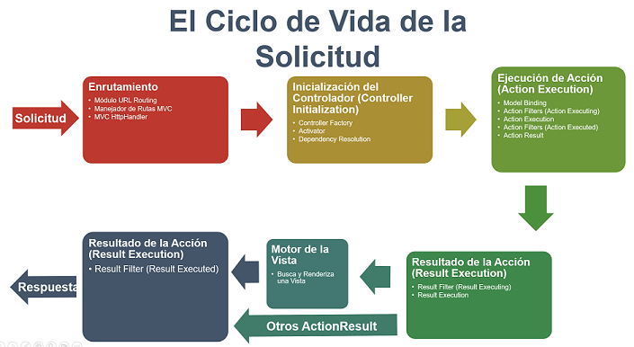
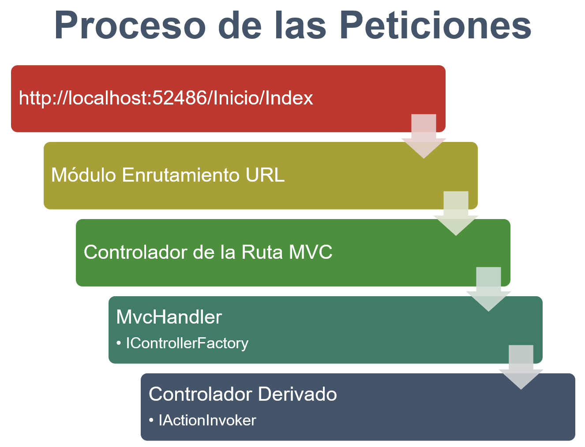
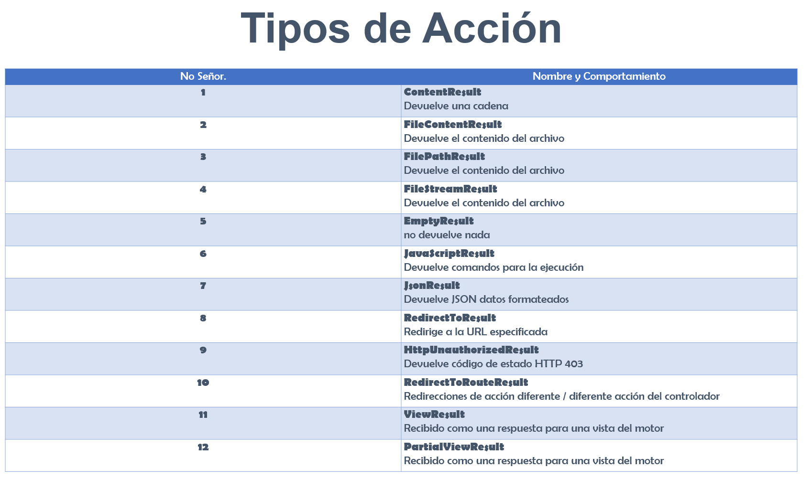

- [Curso Completo de Desarrollo ASP.NET MVC](#curso-completo-de-desarrollo-aspnet-mvc)
  - [Introducción](#introducción)
  - [Comenzando](#comenzando)
  - [Conociendo ASP.NET MVC](#conociendo-aspnet-mvc)
    - [Primera aplicación](#primera-aplicación)
    - [El Ciclo de Vida](#el-ciclo-de-vida)
    - [El Enrutamiento](#el-enrutamiento)
    - [Los Controladores](#los-controladores)
    - [Las acciones](#las-acciones)
      - [Un Controlador puede redirigir a otro Controlador.](#un-controlador-puede-redirigir-a-otro-controlador)
    - [Los Filtros](#los-filtros)
      - [Algunos filtros son:](#algunos-filtros-son)
      - [ASP.NET tiene 4 tipo de filtros](#aspnet-tiene-4-tipo-de-filtros)
    - [Los Selectores](#los-selectores)
    - [Las Vistas](#las-vistas)
    - [Razor](#razor)
    - [Gestión de paquetes Nuget](#gestión-de-paquetes-nuget)
  - [Trabajando con datos](#trabajando-con-datos)
    - [El Modelo](#el-modelo)
    - [El uso de HTML Helpers](#el-uso-de-html-helpers)
    - [Model Binding](#model-binding)
    - [Las Bases de Datos](#las-bases-de-datos)
      - [Conexion con la base de datos](#conexion-con-la-base-de-datos)
    - [La Validación de Datos](#la-validación-de-datos)
      - [Para actualizar la base de datos y cambios en el modelo de datos](#para-actualizar-la-base-de-datos-y-cambios-en-el-modelo-de-datos)
    - [Autenticación y Autorización Parte 1](#autenticación-y-autorización-parte-1)
    - [Autenticación y Autorización Parte 2](#autenticación-y-autorización-parte-2)
    - [El uso de la Caché](#el-uso-de-la-caché)
      - [Perfiles de Caché](#perfiles-de-caché)
      - [CodeFirst](#codefirst)
    - [Dataannotations Parte 1](#dataannotations-parte-1)
      - [Espacio de nombres System.ComponentModel.DataAnnotations](#espacio-de-nombres-systemcomponentmodeldataannotations)
    - [Dataannotations Parte 2](#dataannotations-parte-2)
      - [Espacio de nombres System.ComponentModel.DataAnnotationsSchema](#espacio-de-nombres-systemcomponentmodeldataannotationsschema)
    - [Scaffolding](#scaffolding)
  - [Web API](#web-api)
    - [Que es la Web API](#que-es-la-web-api)
    - [Características de la Web API](#características-de-la-web-api)
    - [Creación de una aplicación RESTful](#creación-de-una-aplicación-restful)
  - [Formularios](#formularios)
    - [El uso de los formularios](#el-uso-de-los-formularios)
    - [Métodos de creación de formularios](#métodos-de-creación-de-formularios)
    - [Formularios de registro simple](#formularios-de-registro-simple)
      - [DbFirst](#dbfirst)

# [Curso Completo de Desarrollo ASP.NET MVC](https://www.udemy.com/course/curso-completo-de-desarrollo-asp-net-mvc-5/)

Capítulos: 12 secciones 97 clases

ProyectoNombre:   
ProyectoTipo: Net Framework MVC  
MarcoVersion: 4.5.1  
VS 2015
 

## [Introducción](https://www.udemy.com/course/curso-completo-de-desarrollo-asp-net-mvc-5/learn/lecture/7040344#learning-tools)

## [Comenzando](https://www.udemy.com/course/curso-completo-de-desarrollo-asp-net-mvc-5/learn/lecture/7040406#learning-tools)

Que es ASP.NET  
Beneficios de ASP.NET MVC  
El Patron MVC  
El entorno de desarrollo  
- Referencia a paginas con pluggin para VS y programas fuentes comerciales.

## Conociendo ASP.NET MVC

### [Primera aplicación](https://www.udemy.com/course/curso-completo-de-desarrollo-asp-net-mvc-5/learn/lecture/7040522#learning-tools)

~~~ C#
namespace MiPrimeraAplicacion2.Controllers
{
    public class HomeController : Controller
    {
        // GET: Home
        public string Index()
        {
            return "Muestra un simple mensaje";
        }
    }
}
~~~

### [El Ciclo de Vida](https://www.udemy.com/course/curso-completo-de-desarrollo-asp-net-mvc-5/learn/lecture/7040530#learning-tools)

Ciclo de vida de una solicitud http a medida que viaja a travez del framework

### [El Enrutamiento](https://www.udemy.com/course/curso-completo-de-desarrollo-asp-net-mvc-5/learn/lecture/7175442#learning-tools)

### [Los Controladores](https://www.udemy.com/course/curso-completo-de-desarrollo-asp-net-mvc-5/learn/lecture/7175462#learning-tools)

Es la parte central en una aplicación  
Son clases en C#  

### [Las acciones](https://www.udemy.com/course/curso-completo-de-desarrollo-asp-net-mvc-5/learn/lecture/7175464#learning-tools)

La única restricción del método de acción, es que tiene que ser un método de instancia, nunca pueden ser métodos estáticos.  
No tiene restricción para el tipo de valor a devolver.  

- Llamadas a "Métodos de Acción"
- Ejecutan solicitudes
- Generan las Respuestas a las solicitudes
- Suelen tener Correlación una a uno

Las acciones son el último destino de la solicitud.

{width='50px' height='50px'}

#### Un Controlador puede redirigir a otro Controlador.

Para manejar el flujo de la aplicación.

`RedirectToAction("Método","Controlador");`

~~~ c#
namespace MiControladorMVC.Controllers
{
    public class HomeController : Controller
    {
        // GET: Home
        public ActionResult Index()
        {
            return RedirectToAction("TodosLosProveedores","Proveedores");
        }
    }
}
~~~

En este caso el controlador Home redirije al controlador Proveedores y al método TodosLosProveedores.

### [Los Filtros](https://www.udemy.com/course/curso-completo-de-desarrollo-asp-net-mvc-5/learn/lecture/7175480#learning-tools)

Son clases que proporcionan comportamiento de pre-acción o pos-acción a los controladores.
Se pueden aplicar a una parte o a todo un Controlador.

#### Algunos filtros son:

- **OutputCache**: Almacena en cache los resultados de una acción por el tiempo que se le especifique.
- **HandleError**: Maneja los errores generados cuando se ejecuta una acción.
- **Autorize**: Permite restringir el acceso a una acción, sea a un usuario o a un rol en particular.

#### ASP.NET tiene 4 tipo de filtros

| Tipos de filtro | Implementa el attr. |
|-----------------|---------------------|
| de Autorización | IAutorizationFilter |
| de Acción       | IActionFilter       |
| de Resultado    | IResultFilter       |
| de Exepción     | IExceptionFilter    |

Se ejecutan en el orden presentado.

> Ejemplo de implementación de Filtro

~~~ c#
namespace MiFiltroMVC.Controllers
{
    public class HomeController : Controller
    {
        [Autorize]
        // GET: Home
        public string Index()
        {
            return "Controlador Home";
        }

        [Authorize (Roles = "Admin")]
        [OutputCache (Duration = 10)]
        public string HoraActual()
        {
            return DateTime.Now.ToString("T");
        }
    }
}
~~~ 

En este caso muestra por pantalla mensajes de usuario no autorizado.
Siendo esta una forma sencilla de implementar funcionalidades mediante los filtros que proporciona .Net.

### [Los Selectores](https://www.udemy.com/course/curso-completo-de-desarrollo-asp-net-mvc-5/learn/lecture/7175508#learning-tools)

Son atributos que se pueden aplicar a los métodos de acción. Se pueden utilizar para influir a los métodos de acción, que se invocan en respuesta a una petición en particular.  

- ActionName - Cambia nombre al método.
- NonAction - Hace que no se ejecute ese método.
- ActionVerbs - Modifica el verbo http (p.ej. [HttpGet])

    Ejemplo del Selector ActionName.  

No se puede acceder con el nombre del método HoraActual, solo se puede acceder con el nombre Hora. Que es el definido por el selecctor.

~~~ c#
namespace MiFiltroMVC.Controllers
{
    public class HomeController : Controller
    {
        // GET: Home
        public string Index()
        {
            return "Controlador Home";
        }

        [ActionName ("Hora")]
        public string HoraActual()
        {
            return DateTime.Now.ToString("T");
        }
    }
}
~~~

    Ejemplo del Selector ActionName.  

No se puede invocar directamente el método CadenaHora, pero desde el método HoraActual, si se puede acceder.

~~~ c#
namespace MiFiltroMVC.Controllers
{
    public class HomeController : Controller
    {
        // GET: Home
        public string Index()
        {
            return "Controlador Home";
        }

        [ActionName ("Hora")]
        public string HoraActual()
        {
            return CadenaHora();
        }

        [NonAction]
        public string CadenaHora()
        {
            return "Son las " + DateTime.Now.ToString("T");
        }
    }
}
~~~

### [Las Vistas](https://www.udemy.com/course/curso-completo-de-desarrollo-asp-net-mvc-5/learn/lecture/7190930#learning-tools)

En ASP MVC .NET no existe nada como una página, ni existe un elemento que se corresponda directamente con una página cuando especificamos una ruta de url. Lo más parecido son las Vistas (Views).
Están pensadas para encapsular la lógica de presentación. Es decir nunca debe contener lógica de la aplicacón y concexión con la base de datos.
Es el punto que tiene el usuario para interactuar con la aplicación.

- Vistas Frenta a páginas
- Lógica de Presentación
- Muestra la interfaz al Usuario
- Método View()
 
### [Razor](https://www.udemy.com/course/curso-completo-de-desarrollo-asp-net-mvc-5/learn/lecture/7190934#learning-tools)

Es una sintaxis de marcado que nos permite incluir código de páginas web del lado del servidor, utilizando C#.  
Razon no es un lenguaje de programación, no es exclusibo de .Net.  
Es un motor de plantillas de propósito general.  

### [Gestión de paquetes Nuget](https://www.udemy.com/course/curso-completo-de-desarrollo-asp-net-mvc-5/learn/lecture/7190942#learning-tools)

Pasos internos que realiza el gestor de paquetes, y que debería realizar el desarrollador sin este gestor.

- Encontrar el componente
- Descargarlo
- Descomprimir el archivo
- Construir el binario
- Incluir referencias en el proyecto
- Configurarlo

## Trabajando con datos

### [El Modelo](https://www.udemy.com/course/curso-completo-de-desarrollo-asp-net-mvc-5/learn/lecture/7320098#learning-tools)

Es donde se almacenan los datos, que se recuperan en un controlador y se van a mostrar en una vista.  
No es más que una coleccón que vá a trabajar con los datos y la lógica de negocios de la aplicación.  

### [El uso de HTML Helpers](https://www.udemy.com/course/curso-completo-de-desarrollo-asp-net-mvc-5/learn/lecture/7320104#learning-tools)

En MVC no existe una caja de herramientas para arrastrar y soltar controles html.  
Con lo cual, para crear una vista, debe realizarse mediante código html.  
Para superar este problema .NET provee html helpers.  
Todos los métodos htm helpers, generan html en tiempo de ejecución.  
Está diseñada para generar la interface de usuario. Nunca deben utilizarse dentro de controladores o modelos.  

- Createinputs - Crean entradas.
- Createlinks - Crean enlaces basadas en las tablas de enrutamiento.
- Create forms - Crean etiquetas de formulario que se pueden enviar a la acción. O a otro controlador diferente.

La sintaxis es: `@Html.xxx`

[Listado de HtmlHelpers](img/04/ListadoDeHtmlHelper.pdf)

### [Model Binding](https://www.udemy.com/course/curso-completo-de-desarrollo-asp-net-mvc-5/learn/lecture/7320118#learning-tools)

El model binding no es mas que el proceso de creación de objetos que nos permite asignar los datos de una petición http a un modelo .NET, utilizando los datos utilizados por el navegador en una petición http.  
Es un puente entre la petición http y los métodos de acción escritos en C#.  Esto hace más fácil trabajar con los formularios que se implementan en las vistas.  
ASP MVC utiliza carpetas predeterminadas para completar estas acciones en un segundo plano.  

Cuando el cliente introduce los valores en la vista Create, estos datos van a estar disponibles en nuestra aplicación, tanto en FormCollection como en RequestForm.

Nos permite agregar un registro, utilizando las propiedades del modelo con solamente una línea de código. Sin necesidad de introducir todas las líneas de código que requiere form collection y sin la necesidad de convertir los tipos de datos para que coincidan con el modelo.  

~~~ C#
// POST: Clientes/Create
[HttpPost]
public ActionResult Create(Clientes emp) 
{
    try
    {
        empList.Add(emp);
        return RedirectToAction("Index");
    }
    catch
    {
        return View();
    }
}
~~~ 

### [Las Bases de Datos](https://www.udemy.com/course/curso-completo-de-desarrollo-asp-net-mvc-5/learn/lecture/7320122#learning-tools)

Para almacenar y recuperar los datos vamos a utilizar una tecnología de acceso a datos de .NET Framework que se conoce como Entity Framework.  
Sirve para definir y trabajar con los modelos. Soporta la técnica de codeFirst, que nos permite la creación de objetos del modelo escribiendo clases simples, luego las bases de datos serán creadas sobre la marcha desde las clases. Permitiendo un flujo de desarrollo muy rápido y limpio.  

Para el caso de .NET Framework se debe instalar el paquete nugget EntityFramework a secas. Sin que diga la palabra Core.

#### Conexion con la base de datos

1. Con una cadena de conexion en el archivo Web.config entre las etiquetas Connection.
2. Si no se genera este fichero, el propio entityFramework añade una tabla a la base de datos con el nombre de tabla, igual al nombre de la clase derivada de DbContext.

> Nota: **Si no se indica, EntityFramework crea una base de datos con el nombre del proyecto y tablas con los nombres de las clases que lo definen.**

### [La Validación de Datos](https://www.udemy.com/course/curso-completo-de-desarrollo-asp-net-mvc-5/learn/lecture/7320132#notes)

#### Para actualizar la base de datos y cambios en el modelo de datos

En la consola de administación de paquetes: 

- enable-migrations
- add-migrations Dataannotations
- update-database

### [Autenticación y Autorización Parte 1](https://www.udemy.com/course/curso-completo-de-desarrollo-asp-net-mvc-5/learn/lecture/7320136#notes)

La autenticación no es más que la verificación de la identidad del usuario.

- Sin Autenticación
- Cuentas usuarios individuales (Credenciales en base de dato o en web de terceros)
- Cuentas profesionales y educativas (Active directory)
- Autenticación de Windows (Para aplicaciones intranet)

### [Autenticación y Autorización Parte 2](https://www.udemy.com/course/curso-completo-de-desarrollo-asp-net-mvc-5/learn/lecture/7533592#notes)

~~~ C#
[Authorize (Users = "tucorreo@email.com")] 
[AllowAnonymous]
~~~

Tanto para controladores como para métodos.  
Para definir que roles pueden acceder a la parte privada.

### [El uso de la Caché](https://www.udemy.com/course/curso-completo-de-desarrollo-asp-net-mvc-5/learn/lecture/7489292#notes)

- Mejora el rendimiento de las aplicaciones
- Evita la ejecución de consultas recurrentes
- Evita la ejecución de procesos recurrentes en el servidor

~~~ C#
[OutputCache(Duration = 60)] 

[OutputCache (Duration = int.MaxValue, VaryByParam ="id")] // Para que almacene en caché el máximo tiempo posible los dátos para el parámetro id
 ~~~

 #### Perfiles de Caché

 Se definen en el web.config

~~~ html
   <system.web>
	  <caching>
		  <outputCacheSettings>
			  <outputCacheProfiles>
				  <add name = "Cache5Minutos" duration = "300" varyByParam="none"/>
			  </outputCacheProfiles>
		  </outputCacheSettings>
	  </caching>
~~~

#### CodeFirst

[Resumen de DataAnnotations](img/04/CodeFirst.pdf)

### [Dataannotations Parte 1](https://www.udemy.com/course/curso-completo-de-desarrollo-asp-net-mvc-5/learn/lecture/7494034#notes)

Se utilizan para configurar las clases del modelo en ASP .NET MVC.  
Permite utilizar las mismas anotaciones para las validaciones del lado cliente.  
Reemplazan a las convenciones predeterminada de CodeFirst.  
EF intica que todas las tablas deben tener al menos una propiedad clave.

#### Espacio de nombres System.ComponentModel.DataAnnotations

Afectan a la nulabilidad o al tamaño de la columna.

[Key] Por convencion CodeFirst toma como campos clave propiedades ID o NombreTabla_ID
Para claves compuestas se debe indicar el orden de las columnas.
[key, Column(Order = 1)]
[key, Column(Order = 2)]
[MaxLength(24)] Solo para strings
[MinLength(5)]
[MaxLength(24), MinLength(5)] Se pueden combinar

### [Dataannotations Parte 2](https://www.udemy.com/course/curso-completo-de-desarrollo-asp-net-mvc-5/learn/lecture/7489494#notes)

#### Espacio de nombres System.ComponentModel.DataAnnotationsSchema

Afectan al esquema de la base de datos.

- [Table("NombreTabla")] - Que nombre va a tener la tabla, por omision le asigna el nombre de la clase.
- [Column("NombreColumna")] - Por omision le asigna el nombre de la propiedad
- [Index] - Agregar indice a la base de datos. ix_nombrePropiedad
- [ForeignKey("CampoFK")] / public virtual Alumno Alumno {get; set;} - 
- [NotMapped] - Para que no genere ese campo en la BD.
- [InverseProperty("NombreCampoDeOtraTabla")]

[Código fuente del capítulo](https://www.udemy.com/course/curso-completo-de-desarrollo-asp-net-mvc-5/learn/lecture/7489336#learning-tools)

### [Scaffolding](https://www.udemy.com/course/curso-completo-de-desarrollo-asp-net-mvc-5/learn/lecture/7320142#learning-tools)

Es un framework de generación de código para aplicaciones web ASP .NET. Se suele usar Scaffolding cuando queremos generar rápidamente código que va a interactuar con los modelos de datos de nuestra aplicación.  

## Web API

### [Que es la Web API](https://www.udemy.com/course/curso-completo-de-desarrollo-asp-net-mvc-5/learn/lecture/7494062#learning-tools)

Se utiliza para la integración con un sistema externo.  
REST = Transferencia de estado representacional.  Ayula a reducir la sobrecarga de la aplicación y limita los datos que son transmitidos entre sistemas Cliente - Servidor.  

ASP.NET Web API = Es un Framework creado para apoyar y simplificar la creación de servicios http que puedan ser consumidos por una gran variedad de clientes diferentes.  Diseñado para crear servicios RESTful y RPC.  
Comparte con MVC: Enrutamiento, Seguridad, controladores ...

- PUT - CREATE
- GET - READ
- POST- UPDATE
- DELETE - DELETE

### [Características de la Web API](https://www.udemy.com/course/curso-completo-de-desarrollo-asp-net-mvc-5/learn/lecture/7494068#learning-tools)

Tambien utliliza controladores, comparte asignar las solicitudes http a las acciones del controlador.  
En lugar de usar una plantilla para la salida y un motor de vista para renderizar un resultado.  Lo que hace es procesar directamente el objeto modelo resultante como respuesta a la petición http entrante.  
La principal diferencia es que los controladores API desacoplan el código de serialización de los resultados. Es decir, cada método de la web API devuelven los resulados JSON sin serialización.  

El formato se selecciona autmáticamente en función de la cabecera accept de la solicitud http entrante. Los mas utilizados con JSON y XML.

Los controladores de Web API pueden estar alojados fuera del runtime de ASP.NET o IISS.

Los nombres de las acciones van a comenzar con uno de los verbos http. Los que no comienzan por uno de los verbos, se le asignará el verbo POST.  

Rutas para las acciones:
`/Api/productos/{id}`  

Donde Api es la ruta por convension. Productos es el nombre del controlador. E id el el parámetro que esperamos recibir.

### [Creación de una aplicación RESTful](https://www.udemy.com/course/curso-completo-de-desarrollo-asp-net-mvc-5/learn/lecture/7494126#learning-tools)

Los modelos son objetos que representan los datos de nuestra aplicación que se pueden serializar automáticamente a JSON, XML u otro formato.  

## Formularios

### [El uso de los formularios](https://www.udemy.com/course/curso-completo-de-desarrollo-asp-net-mvc-5/learn/lecture/7503984#learning-tools)

No es mas que un contenedor de elementos de entrada de un usuario. (cudro de texto, casilla de verificación. botón ...)

El principal objetivo, es que el usuario envíe datos a una aplicación web.

Los atributos más importantes de le etiqueta form de html.
- Action - Le indica al navegador a donde tiene que enviar la información, por lo cual suele ser una url. Soporta rutas relativas y absolutas.  
- Method - Es el atributo donde se asigna el método de envío. Le dice al navegador si debe usar Get o Post para enviar la información. El predeterminado es Get.

Si no es por cuestiones de seguridad, es preferible utilizar solicitudes Get.  
El método Post, es el método usado cuando se realiza un proceso de compra, un usuario registrado actualiza sus datos en la apliación web...  

### [Métodos de creación de formularios](https://www.udemy.com/course/curso-completo-de-desarrollo-asp-net-mvc-5/learn/lecture/7504006#learning-tools)

Se puede utilizar html y htmlHelpers indistintamente.  Los Helpers brindan funcionalidades de validación y acceso a datos de una forma muy cómoda.  
Se puede mezclar la sintaxis Razon con los HtmlHelpers.  

### [Formularios de registro simple](https://www.udemy.com/course/curso-completo-de-desarrollo-asp-net-mvc-5/learn/lecture/7504060#learning-tools)

#### DbFirst

Añadir un objeto Entity Data Model.  
La cadena de conexion se guarda en el archivo web.config.

