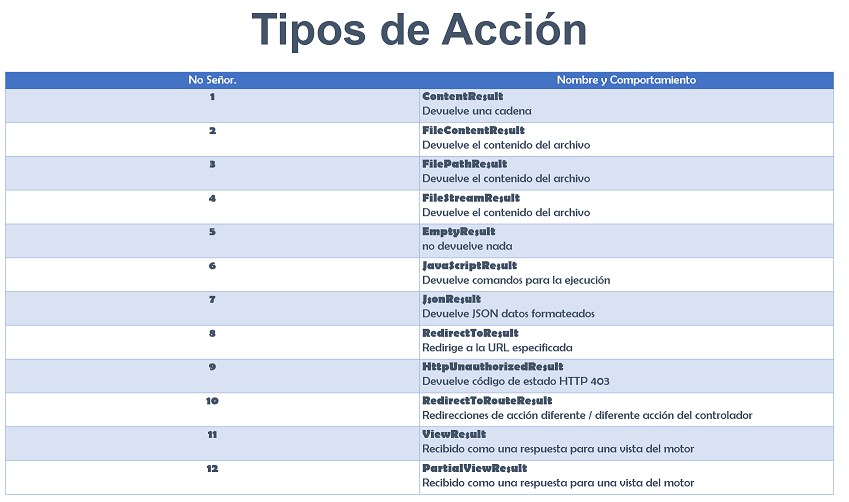

- [Curso Completo de Desarrollo ASP.NET MVC](#curso-completo-de-desarrollo-aspnet-mvc)
  - [Introducción](#introducción)
  - [Comenzando](#comenzando)
  - [Conociendo ASP.NET MVC](#conociendo-aspnet-mvc)
    - [Mi primera aplicación](#mi-primera-aplicación)
    - [El Ciclo de Vida](#el-ciclo-de-vida)
    - [El Enrutamiento](#el-enrutamiento)
    - [Los Controladores](#los-controladores)
    - [Las acciones](#las-acciones)
      - [Un Controlador puede redirigir a otro Controlador.](#un-controlador-puede-redirigir-a-otro-controlador)
    - [Los Filtros](#los-filtros)
      - [Algunos filtros son:](#algunos-filtros-son)
      - [ASP.NET tiene 4 tipo de filtros](#aspnet-tiene-4-tipo-de-filtros)
    - [Los Selectores](#los-selectores)
    - [Las Vistas](#las-vistas)
    - [Razor](#razor)
    - [Gestión de paquetes Nuget](#gestión-de-paquetes-nuget)
  - [Trabajando con datos](#trabajando-con-datos)
    - [El Modelo](#el-modelo)
    - [El uso de HTML Helpers](#el-uso-de-html-helpers)

# [Curso Completo de Desarrollo ASP.NET MVC](https://www.udemy.com/course/curso-completo-de-desarrollo-asp-net-mvc-5/)

Capítulos: 12 secciones 97 clases

ProyectoNombre:   
ProyectoTipo: Net Framework MVC  
MarcoVersion: 4.5.1  
VS 2015
 

## [Introducción](https://www.udemy.com/course/curso-completo-de-desarrollo-asp-net-mvc-5/learn/lecture/7040344#learning-tools)

## [Comenzando](https://www.udemy.com/course/curso-completo-de-desarrollo-asp-net-mvc-5/learn/lecture/7040406#learning-tools)

Que es ASP.NET  
Beneficios de ASP.NET MVC  
El Patron MVC  
El entorno de desarrollo  
- Referencia a paginas con pluggin para VS y programas fuentes comerciales.

## Conociendo ASP.NET MVC

### [Mi primera aplicación](https://www.udemy.com/course/curso-completo-de-desarrollo-asp-net-mvc-5/learn/lecture/7040522#learning-tools)

~~~ C#
namespace MiPrimeraAplicacion2.Controllers
{
    public class HomeController : Controller
    {
        // GET: Home
        public string Index()
        {
            return "Muestra un simple mensaje";
        }
    }
}
~~~

### [El Ciclo de Vida](https://www.udemy.com/course/curso-completo-de-desarrollo-asp-net-mvc-5/learn/lecture/7040530#learning-tools)

Ciclo de vida de una solicitud http a medida que viaja a travez del framework

### [El Enrutamiento](https://www.udemy.com/course/curso-completo-de-desarrollo-asp-net-mvc-5/learn/lecture/7175442#learning-tools)

### [Los Controladores](https://www.udemy.com/course/curso-completo-de-desarrollo-asp-net-mvc-5/learn/lecture/7175462#learning-tools)

Es la parte central en una aplicación  
Son clases en C#  

### [Las acciones](https://www.udemy.com/course/curso-completo-de-desarrollo-asp-net-mvc-5/learn/lecture/7175464#learning-tools)

La única restricción del método de acción, es que tiene que ser un método de instancia, nunca pueden ser métodos estáticos.  
No tiene restricción para el tipo de valor a devolver.  

- Llamadas a "Métodos de Acción"
- Ejecutan solicitudes
- Generan las Respuestas a las solicitudes
- Suelen tener Correlación una a uno

Las acciones son el último destino de la solicitud.

{width='50px' height='50px'}

#### Un Controlador puede redirigir a otro Controlador.

Para manejar el flujo de la aplicación.

`RedirectToAction("Método","Controlador");`

~~~ c#
namespace MiControladorMVC.Controllers
{
    public class HomeController : Controller
    {
        // GET: Home
        public ActionResult Index()
        {
            return RedirectToAction("TodosLosProveedores","Proveedores");
        }
    }
}
~~~

En este caso el controlador Home redirije al controlador Proveedores y al método TodosLosProveedores.

### [Los Filtros](https://www.udemy.com/course/curso-completo-de-desarrollo-asp-net-mvc-5/learn/lecture/7175480#learning-tools)

Son clases que proporcionan comportamiento de pre-acción o pos-acción a los controladores.
Se pueden aplicar a una parte o a todo un Controlador.

#### Algunos filtros son:

- **OutputCache**: Almacena en cache los resultados de una acción por el tiempo que se le especifique.
- **HandleError**: Maneja los errores generados cuando se ejecuta una acción.
- **Autorize**: Permite restringir el acceso a una acción, sea a un usuario o a un rol en particular.

#### ASP.NET tiene 4 tipo de filtros

| Tipos de filtro | Implementa el attr. |
|-----------------|---------------------|
| de Autorización | IAutorizationFilter |
| de Acción       | IActionFilter       |
| de Resultado    | IResultFilter       |
| de Exepción     | IExceptionFilter    |

Se ejecutan en el orden presentado.

> Ejemplo de implementación de Filtro

~~~ c#
namespace MiFiltroMVC.Controllers
{
    public class HomeController : Controller
    {
        [Autorize]
        // GET: Home
        public string Index()
        {
            return "Controlador Home";
        }

        [Authorize (Roles = "Admin")]
        [OutputCache (Duration = 10)]
        public string HoraActual()
        {
            return DateTime.Now.ToString("T");
        }
    }
}
~~~ 

En este caso muestra por pantalla mensajes de usuario no autorizado.
Siendo esta una forma sencilla de implementar funcionalidades mediante los filtros que proporciona .Net.

### [Los Selectores](https://www.udemy.com/course/curso-completo-de-desarrollo-asp-net-mvc-5/learn/lecture/7175508#learning-tools)

Son atributos que se pueden aplicar a los métodos de acción. Se pueden utilizar para influir a los métodos de acción, que se invocan en respuesta a una petición en particular.  

- ActionName - Cambia nombre al método.
- NonAction - Hace que no se ejecute ese método.
- ActionVerbs - Modifica el verbo http (p.ej. [HttpGet])

    Ejemplo del Selector ActionName.  

No se puede acceder con el nombre del método HoraActual, solo se puede acceder con el nombre Hora. Que es el definido por el selecctor.

~~~ c#
namespace MiFiltroMVC.Controllers
{
    public class HomeController : Controller
    {
        // GET: Home
        public string Index()
        {
            return "Controlador Home";
        }

        [ActionName ("Hora")]
        public string HoraActual()
        {
            return DateTime.Now.ToString("T");
        }
    }
}
~~~

    Ejemplo del Selector ActionName.  

No se puede invocar directamente el método CadenaHora, pero desde el método HoraActual, si se puede acceder.

~~~ c#
namespace MiFiltroMVC.Controllers
{
    public class HomeController : Controller
    {
        // GET: Home
        public string Index()
        {
            return "Controlador Home";
        }

        [ActionName ("Hora")]
        public string HoraActual()
        {
            return CadenaHora();
        }

        [NonAction]
        public string CadenaHora()
        {
            return "Son las " + DateTime.Now.ToString("T");
        }
    }
}
~~~

### [Las Vistas](https://www.udemy.com/course/curso-completo-de-desarrollo-asp-net-mvc-5/learn/lecture/7190930#learning-tools)

En ASP MVC .NET no existe nada como una página, ni existe un elemento que se corresponda directamente con una página cuando especificamos una ruta de url. Lo más parecido son las Vistas (Views).
Están pensadas para encapsular la lógica de presentación. Es decir nunca debe contener lógica de la aplicacón y concexión con la base de datos.
Es el punto que tiene el usuario para interactuar con la aplicación.

- Vistas Frenta a páginas
- Lógica de Presentación
- Muestra la interfaz al Usuario
- Método View()
 
### [Razor](https://www.udemy.com/course/curso-completo-de-desarrollo-asp-net-mvc-5/learn/lecture/7190934#learning-tools)

Es una sintaxis de marcado que nos permite incluir código de páginas web del lado del servidor, utilizando C#.  
Razon no es un lenguaje de programación, no es exclusibo de .Net.  
Es un motor de plantillas de propósito general.  

### [Gestión de paquetes Nuget](https://www.udemy.com/course/curso-completo-de-desarrollo-asp-net-mvc-5/learn/lecture/7190942#learning-tools)

Pasos internos que realiza el gestor de paquetes, y que debería realizar el desarrollador sin este gestor.

- Encontrar el componente
- Descargarlo
- Descomprimir el archivo
- Construir el binario
- Incluir referencias en el proyecto
- Configurarlo

## Trabajando con datos

### [El Modelo](https://www.udemy.com/course/curso-completo-de-desarrollo-asp-net-mvc-5/learn/lecture/7320098#learning-tools)

Es donde se almacenan los datos, que se recuperan en un controlador y se van a mostrar en una vista.  
No es más que una coleccón que vá a trabajar con los datos y la lógica de negocios de la aplicación.  

### [El uso de HTML Helpers](https://www.udemy.com/course/curso-completo-de-desarrollo-asp-net-mvc-5/learn/lecture/7320104#learning-tools)

En MVC no existe una caja de herramientas para arrastrar y soltar controles html.  
Con lo cual, para crear una vista, debe realizarse mediante código html.  
Para superar este problema .NET provee html helpers.  
Todos los métodos htm helpers, generan html en tiempo de ejecución.  
Está diseñada para generar la interface de usuario. Nunca deben utilizarse dentro de controladores o modelos.  

- Createinputs - Crean entradas.
- Createlinks - Crean enlaces basadas en las tablas de enrutamiento.
- Create forms - Crean etiquetas de formulario que se pueden enviar a la acción. O a otro controlador diferente.

La sintaxis es: `@Html.xxx`

[Listado de HtmoHelpers](img/04/ListadoDeHtmlHelper.pdf)

