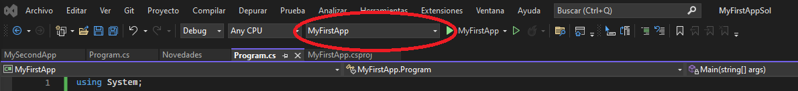

# [Aprende a programar desde cero con C#, Microsoft .NET y WPF](https://www.udemy.com/course/aprende-a-programar-desde-cero-con-c-sharp-de-microsoft-dot-net/)
# $\Bbb{.NET}$
# $\colorbox{blue}{.NET}$
## 01 - Introduccion a .NET y Visual Studio
### 006 - SDK de .net

Es un conjunto de bibliotecas y herramientas de desarrollo y ejecución de aplicaciones .net  
Se instala transparentemente con visual studio.  
Pero tambien se puede instalar por separado.  

El SDK contiene:
- El CLI herramientas de linea de comando para desarrollo
- Driver DotNet es un comando del CLI que ejecuta aplicaciones.
- MSBuild: Es un compilador.
- Runtime: Es solo para ejecutar la aplicación.
- Runtime Library: Librería en tiempo de ejecucion, proporciona tipos de datos primitivos y utilidades fundamentales.
- Runtime ASP.NET Core: Proporciona servicios básicos de aplicaciones conectadas a internet
- Desktop Runtime: Runtime del Escritorio, Consola, Form y WPF.
### 007 - [Proyectos](https://www.udemy.com/course/aprende-a-programar-desde-cero-con-c-sharp-de-microsoft-dot-net/learn/lecture/15968510#overview)

Un proyecto contiene todos los archivos que se compilan en un archivo ejecutable, biblioteca o sitio web.  
Estos archivos pueden incluir codigo, fuente, iconos, imágenes, archivo de datos, etc..  
Un proyecto también contiene la configuración del compilador y otros archivos de configuración que podrían ser necesarios en diversos servicios o componentes con los que el programa se comunica.
#### Extensiones de los proyectos
- .CSPROJ C#
- .VBPROJ Visual Basic
- .DBPROJ Base de Datos
  
  Un proyecto está incluido dentro de una solución.  
  A pesar de su nombre, una solución no se refiere a una respuesta, sino simplemente a un contenedor con uno o más proyectos relacionados junto con la información de compilación, la configuración de las ventanas de Visual Studio y archivos diferentes que no están asociados al proyecto determinado.  
  Una solución se describe mediante un archivo de texto que tiene la extensión sln con su propio formato único.
  Este archivo no está diseñado para modificarse de forma manual.
#### **Solución**: Es un contenedor con 1 o más proyectos relacionados (.sln)
### [008 - Creación de Proyectos](https://www.udemy.com/course/aprende-a-programar-desde-cero-con-c-sharp-de-microsoft-dot-net/learn/lecture/34821812#overview)

Todos los proyectos tienen un punto de entrada.
Inician siempre por un método, que desde .NET 6 no se muestra, pero existe.

Si recuerdan, durante la instalación había una parte donde mostrábamos o seleccionamos las cargas de trabajo.  
Dependiendo de las cargas de trabajo que seleccionamos aquí se podrían mostrar menos o más plantillas.  
Como nosotros vamos a manejar C#, vamos a seleccionar C# y nos cambia a las plantillas que son para C#.  
Nos muestra dos tipos de aplicación de consola, una a secas y otra para punto NET Framework.  
En este curso vamos a estar utilizando la última versión de Punto Net. Entonces vamos a utilizar aplicación de consola a secas.  
La versión para punto Net Framework utiliza todas las versiones de punto net Framework existentes, pero recordemos que Punto Net Framework ya quedó en una última versión y si queremos trabajar con punto Net.  
Al cambiar aquí el nombre del proyecto, también nos cambia el nombre de la solución, pero lo podemos editar para darle un nombre diferente si es lo que deseamos.  
El checkbox de más que dice colocar la solución y el proyecto en el mismo directorio. No se recomienda mantenerlo seleccionado ya que pone tanto la solución como los proyectos en una misma 
carpeta y es más organizado si lo dejamos sin seleccionar.  
Antes de continuar, vamos a explicar que tenemos en cada parte del lado derecho tenemos el explorador de soluciones.  
Este explorador nos permite navegar a través de todos los archivos de nuestro proyecto o nuestra solución.  
Como vimos en la teoría, nuestros proyectos se organizan por soluciones. Es por eso que en la parte raíz tenemos nuestra solución, que se llama My first app Sol de Solution.  
Y adentro contiene un proyecto hasta ahora que se llama My first Up, que es del tipo consola.  
Adentro de este proyecto tenemos algunos otros archivos o secciones que son necesarias para el proyecto mismo, como las dependencias y el Archivo Program.cs. Recordemos que las extensiones dependen del lenguaje que estamos utilizando, es por eso que esta
clase o archivo tiene la extensión cs de C#.  
Todos los proyectos tienen un punto de entrada, es decir, para que podamos entrar a este proyecto o a la aplicación en sí, debe de haber un punto de entrada, es decir, decirle al compilador dónde va a entrar o dónde va a empezar nuestro programa.  
Normalmente esto está marcado por un archivo program en el caso de aplicaciones de consola y un método que ahora desde punto NET 6 ya no aparece aquí, aunque cuando compilamos si existe.  
Para cerrar automáticamente la consola necesitamos habilitar algo. Tenemos que ir a herramientas, opciones, depuración y seleccionar un checkbox. Vamos a Herramientas opciones /  depuración. Vamos a buscar la opción que dice cerrar la consola automáticamente al detenerse la depuración y en la parte de abajo lo podemos encontrar.La seleccionamos, le damos a aceptar y veamos que pasa. Y ahorita lo abrió y lo cerró. No vimos nada porque fue muy rápido.
Para solucionarlo, como ultima línea de nuestro programa se debe colocar `Console.ReadKey();`
#### Evitar hacer que muestre partes que desde Net 6 no muestra, y funcionan como si fuera implicitamente.
- Al crear el proyecto, tildar la opción: No usar instrucciones de nivel superior.
  
  Así se vé la plantilla de ejemplo (helloword), sin marcar la opción.
  ``` C#
  // See https://aka.ms/new-console-template for more information
  Console.WriteLine("Hello, World!");
  ```
  
  Y así se vé con la opción marcada.
  
  ``` C#
  namespace MyFirstApp
  {
    internal class Program
    {
        static void Main(string[] args)
        {
            Console.WriteLine("Hello, World!");
        }
    }
  }
  ```
  
  Todavía falta que muestre los using, y que no los tome de forma implícita.
- Editar archivo de proyecto: (Es un archivo .xml). Sobre el proyecto, clic derecho y seleccionar "Editar archivo de proyecto"
  Abre un archivo como este:
  
  ``` xml
  <Project Sdk="Microsoft.NET.Sdk">
  
  <PropertyGroup>
    <OutputType>Exe</OutputType>
    <TargetFramework>net7.0</TargetFramework>
    <ImplicitUsings>enable</ImplicitUsings>
    <Nullable>enable</Nullable>
  </PropertyGroup>
  
  </Project>
  ``` 
  
  Modificar una línea.
  
  ``` xml
    <ImplicitUsings>disable</ImplicitUsings>
  ```
#### Las directivas using

A partir de punto NET 6.0 lo que hace es ocultar los using más importantes, es decir, todos los  más importantes ya están como cargados por defecto y es por eso que no mandaba ningún error aquí.

Esta directiva using hace referencia al espacio de nombres System. Los espacios de nombres proporcionan un método, digamos, así como jerárquico para organizar nuestras bibliotecas y los programas de system.  
Los espacios de nombres con namespace, contienen tipos o también llamados clases y otros espacios de nombres a su vez.  

**Sintaxis elemental:** Para invocar un método despues del nombre, debe haber paréntesis. Los paréntesis se conocen como el operadó de la invocación del métdo.  
Antes del nombre del método se coloca el nombre de la clase.  
Entre nombre de clase y nombre de método va un punto (.). Al punto se le denomina operador de acceso al miembro.  
La sentencias finaliza con punto y coma (;). Que se denomina operador de final de instrucción.
#### Indicar a VS cual proyecto de la solución debe ejecutar.

### 009 - [Como utilizar los recursos del curso](https://www.udemy.com/course/aprende-a-programar-desde-cero-con-c-sharp-de-microsoft-dot-net/learn/lecture/32132064#overview)
#### **Nota:** Abrir rápidamente y desde cualquier carpeta una solución: Haciendo doble clic sobre el archivo .sln
#### **Nota:** Modo oscuro: Herramientas / Opciones.
### 010 - Modos de compilación y ejecutar desde la consola.
- Debug: Para poder seguir el código.
- Release: Modo más limpio que el tradicional, elimina los archivos temporales de la carpeta bin.
  
  ---
  ---
## 03 - Introducción a los conceptos básicos
### 017 - [Ejemplo rápido con WinForm y WPF](https://www.udemy.com/course/aprende-a-programar-desde-cero-con-c-sharp-de-microsoft-dot-net/learn/lecture/17040996#announcements)
#### **Nota:** Las instancias de tipos de referencia tambien se conocen como objetos.

---
---
- ## 06 - Algorimos y estructuras de datos
-
- ### 036 - [Práctica Matrices](https://www.udemy.com/course/aprende-a-programar-desde-cero-con-c-sharp-de-microsoft-dot-net/learn/lecture/18374732#announcements) #Programación/Cs/Estructuras/Matrices
  id:: 63e5b399-a2dc-4488-a598-26d8bd89239f
   
  Un ejemplo de declaración y uso, pero hay otras formas para hacer lo mismo.
-
- ``` C#
  namespace MyFirstApp
        static void Main(string[] args)
        {
            //Declaración de arreglos 1
            Console.ForegroundColor = ConsoleColor.Red;
            int[] array1 = new int[3];
            array1[0] = 100;
            array1[1] = 200;
            Console.WriteLine($"array1[0] = {array1[0]} y array1[1] = {array1[1]}");
            Console.ReadKey();
        }
  ```
  Otras formas de declarar matrices
  
  ``` C#
  namespace MyFirstApp
    int[] array2 = { 1, 3, 5, 7 };
  
    string[] array3 = { "Lun", "Mar", "Mie", "Jue", "Vie" };
  
    double[] array4;
    array4 = new double[] { 1.1, 2.2, 3.3, 4.4 };
  
    int[][] arrayOfArrays = new int[2][];
  ```
  
  
  Se pueden recorer con `foreach`.
- ### 037 - [Práctica Colas y pilas](https://www.udemy.com/course/aprende-a-programar-desde-cero-con-c-sharp-de-microsoft-dot-net/learn/lecture/18374734#announcements) #Programación/Cs/Estructuras/Pilas #Programación/Cs/Estructuras/Colas
-
- No tiene estructura para ello, pero en el video realiza una implementación de cada uno.
- ### 038 - [Práctica Listas](https://www.udemy.com/course/aprende-a-programar-desde-cero-con-c-sharp-de-microsoft-dot-net/learn/lecture/18374734#announcements) #Programación/Cs/Estructuras/Listas
- formas de declarar listas
  
  ``` C#
     List<int> list1 = new List<int>();
  
     List<int> list2 = new List<int>() { 80, 90, 100, 110 };
  ```
### 039 - [Práctica Otras colecciones](https://www.udemy.com/course/aprende-a-programar-desde-cero-con-c-sharp-de-microsoft-dot-net/learn/lecture/18374734#announcements)

``` C#
  //HashSet no acepta objetos repetidos
   HashSet<string> hashSet = new HashSet<string>();
   hashSet.Add("a");

   //SortedSet organiza una lista ascendentemente
  SortedSet<string> sortedSet = new SortedSet<string>();
  sortedSet.Add("d");

  //Disctionary es una lista de llaves/valor
  Dictionary<string, double> fruitCost = new Dictionary<string, double>();
  fruitCost.Add("Mango", 60);
  
  //SortedList es un Dictionary pero ordenado
  SortedList<string, double> fruitCostSorted = new SortedList<string, double>();
  fruitCostSorted.Add("Mango", 60);
```

---
---
- ## 07 - Manejo de errores y depuración #Programación/Cs/Manejo_de_errores
- Una excepción es cualquier condición de error o comportamiento inesperado que encuentra un programa en su ejecución.
### 041 [Introducción a errores del programa](https://www.udemy.com/course/aprende-a-programar-desde-cero-con-c-sharp-de-microsoft-dot-net/learn/lecture/18528120#announcements)

Las exepciones pueden iniciarse debido a:
- Un error en el código propio.
- Recursos del Sistema Operativo no disponibles.
- Condiciones inesperadas en tiempo de ejecución.
  
  En .NET una excepción es un objeto que hereda de la clase `SYSTEM.EXCEPTION`
### 042 [Introducción al manejo estructurado de errores](https://www.udemy.com/course/aprende-a-programar-desde-cero-con-c-sharp-de-microsoft-dot-net/learn/lecture/18528124#announcements)

``` C#
   try
   {

   }
   catch
   {

   }
   finally
   {

   }
```

En C# las excepciones las utiliza para lo siguiente:
- Intentar realizar acciones que no pueden completarse correctamente.
- Para controlar errores cuando decide que es razonable hacerlo.
- Para limpiar recursos más adelante.
  
  Las Excepciones las pueden generar:
- El framework de .NET.
- Cualquier biblioteca de terceros.
- El código mismo de la aplicación.
  
  >También se pueden lanzar excepciones dentro del programa con la palabra reservada `THROW`.
  
  En muchos casos una excepción no la produce un método al que el programa ha llamado directamente, sino otro método más abajo en la  pila de llamadas.
### 044 [Práctica Try Catch Finally](https://www.udemy.com/course/aprende-a-programar-desde-cero-con-c-sharp-de-microsoft-dot-net/learn/lecture/18528144#announcements)

---
---
## - 08 Introducción a POO
### 046 [Construcciones básicas del sistema común de tipos en .NET Framework](https://www.udemy.com/course/aprende-a-programar-desde-cero-con-c-sharp-de-microsoft-dot-net/learn/lecture/20633778#announcements)

CLASS Y STRUCT

Cada una de ellas es básicamente una estructura de datos que encapsula un conjunto de datos y comportamientos que conforman en si, un conjunto . Es decir como una unidad lógica.
Los datos y comportamientos son los miembros de la clase o estructura, e incluyen sus métodos, propiedades y eventos.
#### CLASS:
Una clase es un tipo de referencia. Cuando se se crea un objeto de la clase, la variable a la que se asigna el objeto, contiene solo una referencia a esa memoria. Es solo un apuntador a un espacio en la memoria.   
Cuando la referencia de objeto se asigna a una variable nueva, la nueva variable hace referencia al objeto original. Los cambios originados en una variable se reflejan en la otra variable, porque ambas hacen referencia a los mismos datos.

[**valor vs referencia*](https://www.youtube.com/watch?v=R_8iA6DjGmA)
#### STRUCT

Una estructura es un tipo de valor. Cuando se crea un struct, la variable a la que se asigna el struct, contiene los datos reales de la estructura. Cuando la estructura se asigna a una nueva variable, se copia, y por lo tanto la nueva variable y la variable original continen 2 copias independientes del mismo dato. Los cambios efectuados en una copia no afectan a la otra copia, como sucede en las clases.

En general las clases se utilizan para modelar comportamientos mas complejos o datos que se preveen modificar después de haber creado un objeto de clase
Las estructuras por el contrario, para  modelar comportamientos mas pequeños o datos que no se prevee modificar luego de haber creado la estructura.

---
- ### 047 [Clases](https://www.udemy.com/course/aprende-a-programar-desde-cero-con-c-sharp-de-microsoft-dot-net/learn/lecture/20633888#announcements) #Programación/Cs/Clases
### 048 [Encapsulación](https://www.udemy.com/course/aprende-a-programar-desde-cero-con-c-sharp-de-microsoft-dot-net/learn/lecture/20634148#announcements)

La encapsulación significa, que un grupo de propiedades, métodos y otros miembros relacionados, se tratan como una sola unidad u objeto.  
Cada clase puede tener distintos miembros de clase entre (propiedades, métodos, eventos.)

[Link externo](https://www.youtube.com/watch?v=fAXJBLfgFVM)
#### Campos y propiedades

Representan información que contiene un objeto
#### **Campos:** 

Se parecen a las variables, ya que se pueden leer o establecer directamente, y son sujetos a los modificadores de acceso. Solo es accesible desde la propia clase.
#### **Propiedades:** 

Tienen descriptores de acceso get y set, que establecen mas control sobre la forma en que se establecen o devuelven los valores.  

``` C#
  public string SecondName 
  { 
      get
      {
          return _secondName;
      } 
      set
      {
          _secondName = value;
      } 
  }
```

Las propiedades implementadas automáticamente no pueden ser de solo lectura.

``` C#
  public string FirstName { get; set; }
```
#### **Método:** 

Es una acción que un objeto puede realizar. Consta de un modificador de acceso, tipo, nombre y posibles parámetros. Se declara dentro de una definición de clase.

``` C#
  public int sampleMethod(string sampleParam)
  {
      return 0;
  }
```

Una clase puede tener varias implementaciones o sobrecargas del mismo método. Se diferencian por el número o tipo de parámetros

``` C#
  public int sampleMethod(int sampleParam)
  {
      return 0;
  }
```
#### **Constructores:**](https://www.youtube.com/watch?v=t0c1H2Juj-M&t=3s) 

Son métodos de clase que se ejecutan automáticamente cuando se crea un objeto de un tipo determinado. Normalmente los constructores inicializan los miembros de los datos del nuevo objeto. Solo puede ejecutarse una vez cuando se crea la clase. Se ejecuta antes que cualquier otro código en una clase.  
Se pueden crear sobrecargas del constructor, de la misma forma que para cualquier otro método.
No tiene un tipo y se llama igual que la clase.

``` C#
  public sampleClass()
  {
      FirstName = "Sin Nombre"
  }
  public sampleClass(string firstName, string secondName)
  {
      FirstName = firstName;
      _secondName = secondName;
  }
```
#### **Finalizadores:**

Se utilizan para destruir instancias de clase. Solo puede haber un finalizador para una clase.

``` C#
  ~sampleClass()
  {
      ...
  }
```
#### **Eventos:** 

Cuando ocurre algo relevante, los eventos habilitan una clase u objeto para notificarlo a otras cases u objetos.
La clase que envía o genera el evento, recibe el nobre de publicador.
Las clases que reciben, o controlan el evento, se denominan suscriptores.
Para declarar un evento se utiliza la palabra `event`.
#### **Clases anidadas:** 

Se denomina así, cuando una clase es definida dentro de otra clase.
De forma predeterminadad, una clase anidada es privada.
- #### [**Modificadores de acceso:** ](https://www.youtube.com/watch?v=fAXJBLfgFVM) #Programación/Cs/Modificadores_de_acceso
  
  Todas las clases y miembros de clase, pueden especificar el nivel de acceso que proporcionan a otras clases mediante los modificadores de acceso.
- **Public**: Permite obtener acceso al tipo miembro a cualquier otro código del mismo ensamblado o de otro ensamblado que haga referencia a este.
- **Protected**: De la misma clase, o una clase derivada.
- **Private**: Solo permite acceso al tipo miembro de la misma clase.
- Internal: A cualquier miembro del mismo ensamblado, pero no de otro ensamblado. (.exe o .dll - En la solución, es otro proyecto)
- Protected Internal: Una combinación de ambas simultaneamente.
- Private Protected: Una combinación de ambas simultaneamente.
  
  ---
- ### 049 [Herencia](https://www.udemy.com/course/aprende-a-programar-desde-cero-con-c-sharp-de-microsoft-dot-net/learn/lecture/20634184#announcements) #Programación/Cs/Herencia
- No todos los miembros de una clase base, los heredan las clases derivadas.  
  Los constructores y los finalizadores no se heredan.  
  Cada calse debe tener sus propios constructores y finalizadores.  
  Se heredan los demas miembros de una clase base. Que dichos miembros estén o no visibles, depende de su accesibilidad.
#### **Override:** 

Las clases derivadas pueden invalidar los métodos derivados al proporcionar una implementación alternativa.  
Para poder invalidar un miembro, el miembro de la clase base debe marcarse con la palabra clave virtual, que de forma predeterminada no están marcados como virtual.
La herencia solo se aplica a clases e interfaces.
Otros tipos de estructura como: STRUCT, DELEGATES o ENUM, no soportan la herencia.

``` C#
  public class A
  {
      public virtual void VirtualMethod()
      {
          // Código del método
      }
      public void NotVirtualMethod()
      {
          // Código del método
      }
  }
  public class B : A
  {
      public override void VirtualMethod()
      {
          // Código del método
      }
      public override void NotVirtualMethod() // Este caso marca error de compilador.
      {
          // Código del método
      }
  }
```
- #### [**Clases Abstractas:**](https://www.youtube.com/watch?v=iRELmavR_eY&t=390s) #Programación/Cs/Clases_abstractas
  
  En algunos casos una clase derivada debe invalidar la implementación de la clase base.
  Los miembros de la clase base marcados con la palabra clave abstract, requieren que las clases derivadas los invaliden, forzosamente.
  Estas no permiten crear instancias de ellas. No se puede crear una instancia de una clase abstracta.
  Una clase abstract sin ningún método abstract, indica que representa un concepto abstracto, que se comparte entre varias clases concretas.
  La palabra reservada abstract, se utiliza para forzar que la clase derivada proporcione una implemtación.
#### **Herencia implícita:** 

Además de los tipos que pueden heredar mediante herencia única, todos los tipos heredan implicitamente de Object, o de un tipo derivado de este.

---
- ### 050 [Enumeraciones](https://www.udemy.com/course/aprende-a-programar-desde-cero-con-c-sharp-de-microsoft-dot-net/learn/lecture/29991256#announcements) #Programación/Cs/Colecciones/Enumeraciones
- Es un tipo de valor definido por constantes. El índice comienza desde 0. Como es un tipo por valor, no es necesario crear una instancia. 
  Suelen ayudar bastante a interpretar el código para quien lo lee.
  
  ``` C#
    piblic enum Days
    {
        Lunes,
        Martes.
        Miercoles
    }
        // Para invocarlo
        Days day = Days.Friday;
  ```
  
  [Link:](https://www.youtube.com/watch?v=bnkphc-DjGA)
  
  ---
### 051 [Práctica clases, encapsulación y herencia](https://www.udemy.com/course/aprende-a-programar-desde-cero-con-c-sharp-de-microsoft-dot-net/learn/lecture/20634242#announcements)

**Clase sealed**: (sellada) Esta palabra se utiliza para indicar que la clase no puede servir como clase base para clases adicionales (hermanas, del mismo nivel).
### 053 [Polimorfismo](https://www.udemy.com/course/aprende-a-programar-desde-cero-con-c-sharp-de-microsoft-dot-net/learn/lecture/20634320#announcements)

En tiempo de ejecución los objetos de una clases derivada, pueden ser tratados como objetos de una clases base (para métodos, colecciones o matrices).
### 054 [Bibliotecas de clases base de .NET](https://www.udemy.com/course/aprende-a-programar-desde-cero-con-c-sharp-de-microsoft-dot-net/learn/lecture/20634422#announcements)

---
### 055 [Record](https://www.udemy.com/course/aprende-a-programar-desde-cero-con-c-sharp-de-microsoft-dot-net/learn/lecture/29994274#announcements)

Es otra manera de definir tipos. Se puede utilizar en lugar de clases o estructuras. Es un tipo por referencia. 
Es "similar" a una clase.
Para el almacenamiento de datos presentan una sintaxis mas concisa.

``` C#
  // Tipo por referencia.
  public record Pet1
  {
      //
  }
  // Tipo por valor.
  public record struct Pet2
  {
      //
  }
```

---
---
## - 09 Entrada / Salida - Manejo de archivos de texto
### 058 [Entrada / Salida en consola](https://www.udemy.com/course/aprende-a-programar-desde-cero-con-c-sharp-de-microsoft-dot-net/learn/lecture/20634714#announcements)

La palabra reservada `using` ayuda en el manejo de objetos en memoria, asegurando que se eliminarán de forma correcta al terminar de ejecutar esa sección.

`SetIn` y `SetOut` redirecciónan la salida estandard de pantalla o archivo con `StreamReader` y `StreamWriter`. Con los métodos OpenText() y CreateText().
La lectura del archivo de produce de a una lectura por cada línea del archivo origen.
### 059 [Usando E/S en archivos](https://www.udemy.com/course/aprende-a-programar-desde-cero-con-c-sharp-de-microsoft-dot-net/learn/lecture/20634746#announcements)

**Nota:** El simbolo `@` al comienzo de una cadena string, ayuda a omitir las secuencias de escape.

Tambien se puede leer un archivo en una sola pasada, con ReadAllText() y WriteAllText() para grabarlo.

---
---
## - 10 Rendimiento y gestión de memoria
### 061 [Tipos de valor vs tipos de referencia]()
#### Tipos por valor:

se alojan en la pila, para datos del tipo primitivo. No se modifican los datos originales, sino que se genera una "copia".
#### Tipos de referencia:

 se alojan en el Heap (Montón), para otros tipos de objetos y variables de tipo que no tienen una longitud determinada, como los string. En estos casos si se modifica los datos originales.
Tiene un menor rendimiento que los tipos de valor.
### 062 [Tipos de conversión - Implícita o de ampliación](https://www.udemy.com/course/aprende-a-programar-desde-cero-con-c-sharp-de-microsoft-dot-net/learn/lecture/20937440#announcements)

No hay pérdida de información, pero puede haber pérdida de precisión.
### 063 [Tipos de conversión - Explícita o de restricción](https://www.udemy.com/course/aprende-a-programar-desde-cero-con-c-sharp-de-microsoft-dot-net/learn/lecture/20937444#announcements)

Puede producir una perdida de datos.
### 064 [Tipos de conversión - System.Convert](https://www.udemy.com/course/aprende-a-programar-desde-cero-con-c-sharp-de-microsoft-dot-net/learn/lecture/20937452#announcements)

Formateo de datos: N2 Dato numérico con 2 decimales.

---
---
## - 11 Implementando multiprocesamiento y procesamiento asíncrono
### 067 [Delegados y Lambda](https://www.udemy.com/course/aprende-a-programar-desde-cero-con-c-sharp-de-microsoft-dot-net/learn/lecture/21497576#announcements9)
#### **Delegados:** 

Tipos de delegados:
- Func:
- Action:
- Predicate:
#### **Lambda:** 
Constituyen una sintaxis más cómoda para el uso de delegados. Declaran una firma y un cuerpo de método pero no tienen una identidad formal propia, a menos que se le asigne un delegado directamente.  
A diferencia de los delegados, se pueden asignar directamente como lado izquierdo del registro de eventos.  Una expresión lambda es solo una forma de especificar un delegado.
### 068 [Hilos (threads)](https://www.udemy.com/course/aprende-a-programar-desde-cero-con-c-sharp-de-microsoft-dot-net/learn/lecture/21164630#announcements)

Cada sub-proceso se ejecuta en su propio hilo.  
Cambios de contexto:
### 069 [Clase THREAD](https://www.udemy.com/course/aprende-a-programar-desde-cero-con-c-sharp-de-microsoft-dot-net/learn/lecture/21164634#announcements)

[Link](https://www.youtube.com/watch?v=FOwdYHKvMf8)

Permite asyn y await a partir de .Net version 4.5.

Pertenece a espacio de nombres System.Threading. Permite gestionar sus hilos, gestionar su pérdida y obtener su estado.
Solo de debe utilizar bajo necesidades específicas.
Se puede asignar 3 niveles de prioridad y si son en primer o segundo plano.
### 071 [ThreadStatic](https://www.udemy.com/course/aprende-a-programar-desde-cero-con-c-sharp-de-microsoft-dot-net/learn/lecture/21164638#announcements)

Al marcar un campo con el atributo ThreadStatic, cada subproceso obtiene su propia copia de un campo determinado.
### 072 [ThreadLocal](https://www.udemy.com/course/aprende-a-programar-desde-cero-con-c-sharp-de-microsoft-dot-net/learn/lecture/21164640#announcements)
### 073 [ThreadPool](https://www.udemy.com/course/aprende-a-programar-desde-cero-con-c-sharp-de-microsoft-dot-net/learn/lecture/21452728#announcements)

Para reutilizar un método que ha finalizado, para no tener que volver a crear un hilo luego.
El crear un proceso consume recursos.
### 074 [Usando Tareas](https://www.udemy.com/course/aprende-a-programar-desde-cero-con-c-sharp-de-microsoft-dot-net/learn/lecture/21452730#announcements)

Representa un trabajo que debe hacerse.  
De manera predeterminada el planificador de tareas utiliza hilos desde un threadpool.
### 075 [ContinueWith](https://www.udemy.com/course/aprende-a-programar-desde-cero-con-c-sharp-de-microsoft-dot-net/learn/lecture/21452736#announcements)
### 078 [Clase Paralel](https://www.udemy.com/course/aprende-a-programar-desde-cero-con-c-sharp-de-microsoft-dot-net/learn/lecture/21538956#announcements)
### 079 [Usando Async y Await](https://www.udemy.com/course/aprende-a-programar-desde-cero-con-c-sharp-de-microsoft-dot-net/learn/lecture/21589256#announcements)

Disponible en c# desde la versión 5.0.  
Las tareas que solo consumen CPU y consumen mucho tiempo, se pueden transferir a otros hilos utilizando el objeto task, pero cuando se realiza un proceso que es de entrada/salida las cosas son un poco diferente.  
Cuando el hilo principal realiza una operación de entrada salida, la aplicación se queda esperando a que esa operación finalice.  
Escribir código asíncrono correctamente es dificil, especialmente cuando se trata de implementar el manejo de escepciones.
### 080 [Usando Async y Await - Escalabilidad](https://www.udemy.com/course/aprende-a-programar-desde-cero-con-c-sharp-de-microsoft-dot-net/learn/lecture/21610144#overview)

ReadAsync:  
WriteAsync

Excepciones en un método asíncrono.
### 081 [Usando Async y Await - SynchronizationContext](https://www.udemy.com/course/aprende-a-programar-desde-cero-con-c-sharp-de-microsoft-dot-net/learn/lecture/21651746#overview)

Se puede deshabilitar.
### 082 [Usando Parallel Language Integrade Query (PLinQ)](https://www.udemy.com/course/aprende-a-programar-desde-cero-con-c-sharp-de-microsoft-dot-net/learn/lecture/21781450#overview)

LinQ con consultas en paralelo.
### 083 [Colecciones Concurrentes](https://www.udemy.com/course/aprende-a-programar-desde-cero-con-c-sharp-de-microsoft-dot-net/learn/lecture/21889118#overview)

No panipular los datos compartidos sin sincronizar el proceso.

Thread Safe:  
BlockinCollection:  
ConcurrentBag:  
ConcurrentStack:  
ConcurrentQueue:  
ConcurrentDictionary:  

---
---
## - 12 Administrando subprocesos múltiples
### 085 [Sincronizando recursos](https://www.udemy.com/course/aprende-a-programar-desde-cero-con-c-sharp-de-microsoft-dot-net/learn/lecture/22151076#overview)
### 086 [Clase Volatile](https://www.udemy.com/course/aprende-a-programar-desde-cero-con-c-sharp-de-microsoft-dot-net/learn/lecture/22168426#overview)

Tiene sus propios métodos de lectura / escritura.
### 087 [Clase Interlocked](https://www.udemy.com/course/aprende-a-programar-desde-cero-con-c-sharp-de-microsoft-dot-net/learn/lecture/22189078#overview)

Convierte algunas operaciones no atómicas en atómicas, como sumar, restar o comparar un string.
Para operaciones complejas se debe usar lock.
### 088 [Cancelando Tareas](https://www.udemy.com/course/aprende-a-programar-desde-cero-con-c-sharp-de-microsoft-dot-net/learn/lecture/22254032#overview)

CancellationTocken: Para cancelar una tarea.  

---
---
## - 13 Events y CallBacks
### 090 [Entendiendo delegados](https://www.udemy.com/course/aprende-a-programar-desde-cero-con-c-sharp-de-microsoft-dot-net/learn/lecture/22400252#overview)

En c++ sería un puntero a un función.  
un delegado instanciado, a final de cuenta es un objeto más. Se pueden pasar como argumento a otros métodos.  
Se pueden combinar, hacer multidifusión (Multicast)
- Covarianza y Contravarianza.
### 091 [Usando Expresiones Lambda](https://www.udemy.com/course/aprende-a-programar-desde-cero-con-c-sharp-de-microsoft-dot-net/learn/lecture/22418538#overview)
### 092 [Usando Eventos]()


---
---
## - 14 Usando TIPOS en modo avanzado.
### 094 [Creando Enumeraciones]()